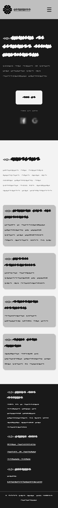
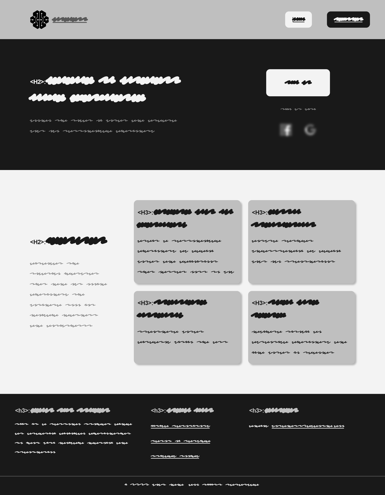
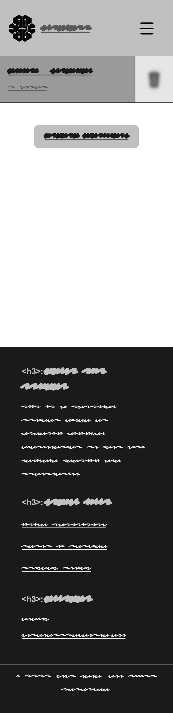
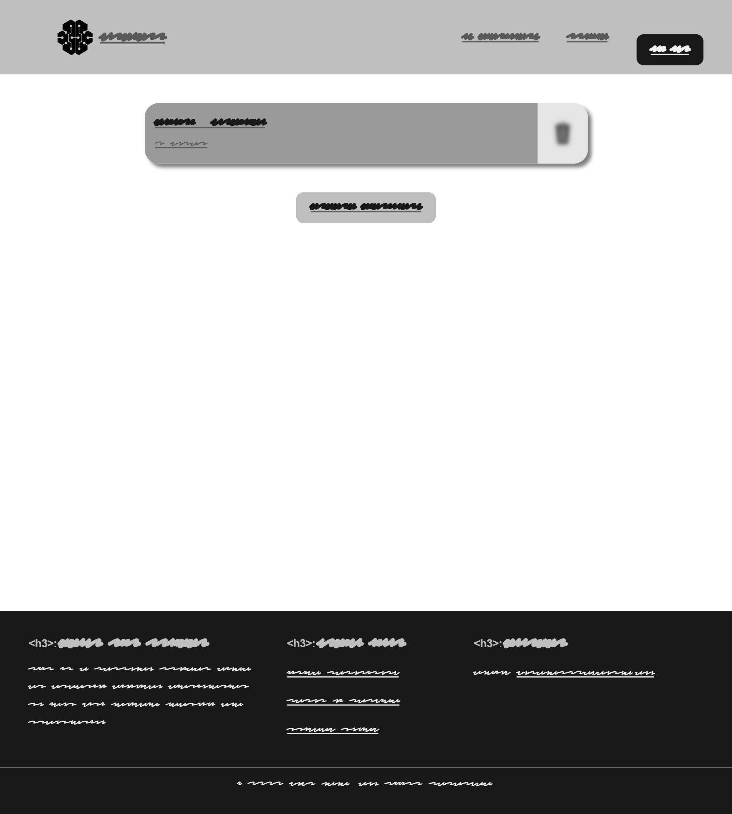
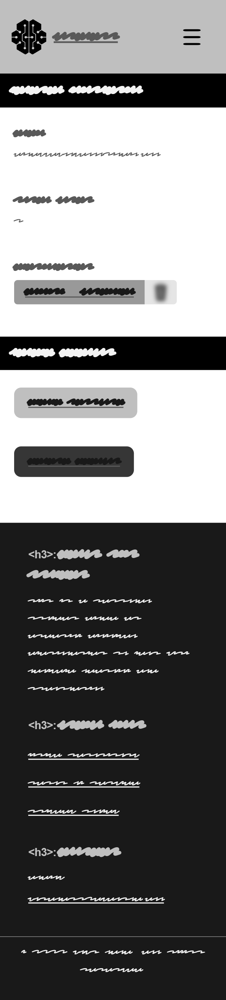
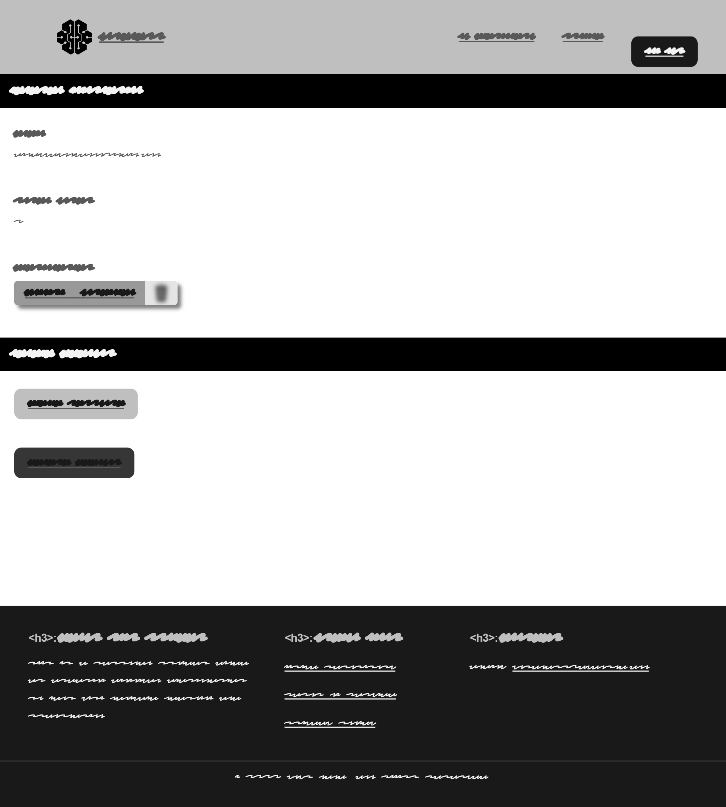
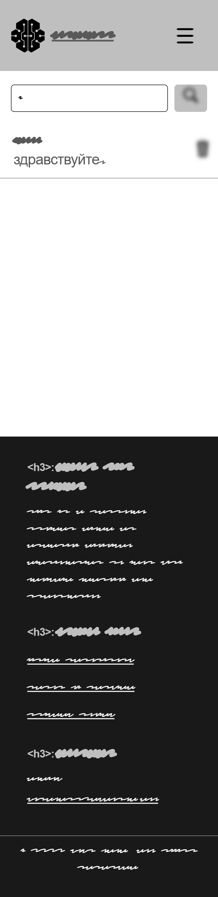
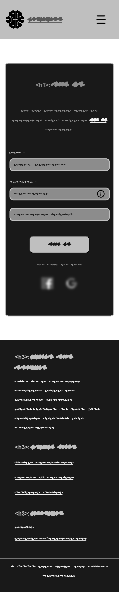
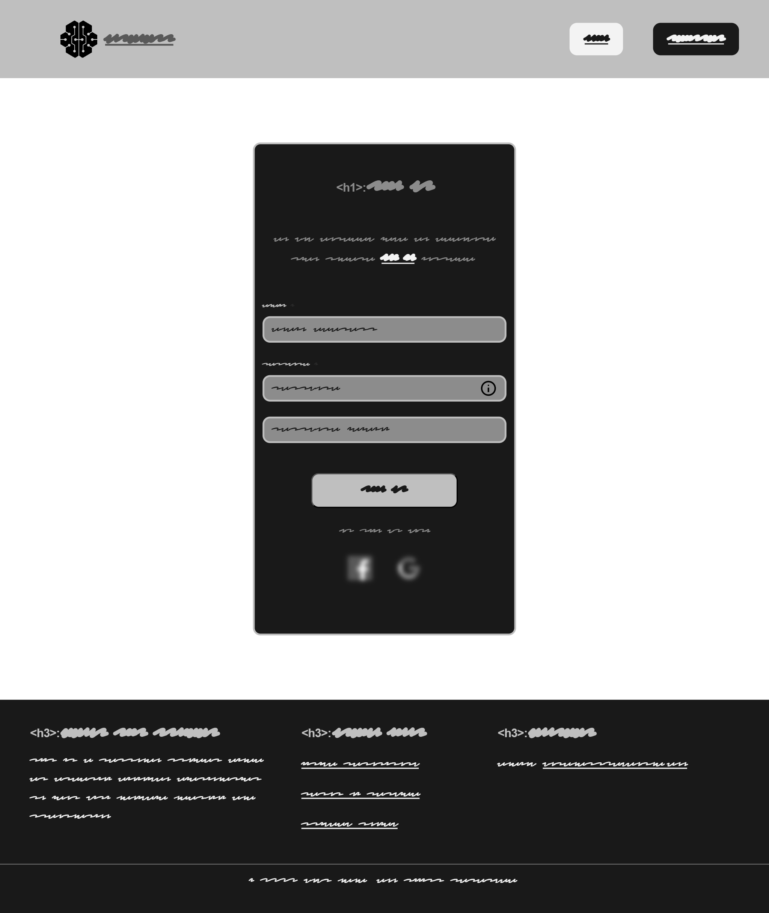
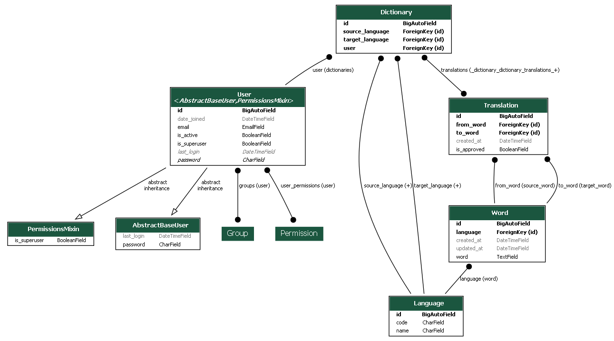

# WordNest (Milestone Project 4)


[WordNest](https://wordnest-f67ad8aa67ee.herokuapp.com/) Online Dictionary is a personal project aimed at creating bilingual dictionaries to help with language learning and translation. I believe that language learning should be a personalized and engaging experience, and the Wordnest is designed to provide the tools and resources you need to succeed.


## Table of contents

-   [WordNest (Milestone Project 4)](#wordnest-milestone-project-4)
    -   [Table of contents](#table-of-contents)
-   [Purpose](#purpose)
-   [UX Design](#ux-design)
    -   [User stories](#user-stories)
        -   [As a **first time user**](#as-a-first-time-user)
        -   [As a **returning user**](#as-a-returning-user)
    -   [UAC](#uac)
    -   [Structure](#structure)
-   [Wireframes](#wireframes)
-   [Design](#design)
    -   [Design](#design-1)
        -   [Colour Scheme](#color-scheme)
        -   [Typography](#typography)
        -   [Images](#images)
        -   [Visual Effects](#visual-effects)
            -   [Onscroll Animation](#onscroll-animation)
-   [Architecture](#architecture)
-   [Features](#features)
-   [Testing](#testing)
    -   [Manual Testing](#manual-testing)
        -   [Navbar](#navbar)
        -   [Footer](#footer)
        -   [Home page](#home-page)
        -   [Dictionary page](#dictionary-page)
        -   [Profile page](#profile-page)
        -   [Forms](#forms)
    -   [Unit testing](#unit-testing)
        -   [Python unit tests](#python-unit-tests)
        -   [JS unit tests](#js-unit-tests)
    -   [Code validation](#code-validation)
    -   [Lighthouse](#lighthouse)
-   [Technologies](#technologies)
    -   [Languages](#languages)
    -   [Programs, frameworks, libraries](#programs-frameworks-libraries)
-   [Deployment](#deployment)
    -   [Github](#github)
    -   [Heroku](#heroku)
    -   [Fork GitHub Repo](#fork-github-repo)
    -   [Clone GitHub Repo](#clone-github-repo)
-   [Credits](#credits)
    -   [Media](#media)
    -   [Design Template](#design-template)
    -   [Code](#code)
    -   [Acknowledgements](#acknowledgements)

<small><i><a href='http://ecotrust-canada.github.io/markdown-toc/'>Table of contents generated with markdown-toc</a></i></small>

# Purpose

The WordNest Online Dictionary is built using the Django framework, which provides robust backend functionality, including user authentication, data management, and routing. The frontend is enhanced by Django's templating system to deliver a seamless and interactive user experience. Additionally, the integration of htmx allows for dynamic content updates without the need for full page reloads, further enhancing the user experience by making interactions smoother and more responsive.

Key features of the platform include personalized dictionary creation, custom translations, instant translations, and quick word searches. These features are designed to provide an engaging and efficient tool for language learners and enthusiasts.

[Table of contents](#table-of-contents)

# UX Design

Target audiences:

- Language Learners and Enthusiasts: Individuals passionate about learning new languages and expanding their vocabulary. These users can benefit from the personalized dictionary and custom translation features.
- Students and Educators: Students looking for a tool to aid their language studies and educators seeking a resource to support their teaching. WordNest can be a valuable addition to their learning and teaching toolkit.
- Bilingual and Multilingual Individuals: People who speak or are learning multiple languages and need a reliable tool to manage and translate vocabulary across languages.


## Epics

To craft an epic logic on GitHub, I begin by creating an issue and assigning it the "Epic" label. Within this issue, I meticulously compile a list of both user and developer stories that are integral to the epic's completion.

You can find all the epics [here](https://github.com/Dima-Bulavenko/wordnest/issues?q=is%3Aissue+label%3AEpic+)

## User and Developer Stories

- **User stories:**
To describe features for my project I used [this user stories](https://github.com/Dima-Bulavenko/wordnest/issues?q=is%3Aissue+author%3A%40me++%22USER+STORY%22+). My user stories are follow [this template](https://github.com/Dima-Bulavenko/wordnest/blob/main/.github/ISSUE_TEMPLATE/user-story.md)


- **Developer stories:**
To describe features for my project I used [this developer stories](https://github.com/Dima-Bulavenko/wordnest/issues?q=is%3Aissue+author%3A%40me++%22DEVELOPER+STORY%22+). My developer stories are follow the same template as the user stories [the same template as the user stories](https://github.com/Dima-Bulavenko/wordnest/blob/main/.github/ISSUE_TEMPLATE/user-story.md) but with different title.

[Back to the top](#table-of-contents)

# Wireframes
All wireframes were created using [figma](https://www.figma.com/). The wireframes are designed to provide a visual representation of the website's layout and functionality across different screen sizes.

## Welcome page

- <details>
  <summary>Mobile</summary>
  
</details>

- <details>
  <summary>Laptop</summary>
  
</details>

## Home page

- <details>
  <summary>Mobile</summary>
  
</details>

- <details>
  <summary>Laptop</summary>
  
  alt="Laptop wire frame">
</details>

## Profile page

- <details>
  <summary>Mobile</summary>
  
</details>

- <details>
  <summary>Laptop</summary>
  
  alt="Laptop wire frame">
</details>

## Dictionary page

- <details>
  <summary>Mobile</summary>
  
</details>

- <details>
  <summary>Laptop</summary>
  
  alt="Laptop wire frame">
</details>

## Form page

- <details>
  <summary>Mobile</summary>
  
</details>

- <details>
  <summary>Laptop</summary>
  
  alt="Laptop wire frame">
</details>

[Back to the Top](#help-u-website-milestone-project-4)

# Agile Development

In this project, we use Agile methodology to manage and track development tasks. Here's a breakdown of how we apply Agile practices:

## Task Management

- **Issues**: Each task is represented by an issue in our GitHub repository.
- **Labels**: Issues are categorized using labels to indicate their priority and importance:
  - `Could Have`
  - `Must Have`
  - `Should Have`
  - `Would Have`
- **Milestones**:
  - **Product Backlog**: This milestone includes all issues that have been identified but not yet assigned to a specific iteration. Issues in this milestone do not have time constraints.
  - **Iteration #number**: Each iteration has a specific duration (one week) and is assigned a milestone. Issues are moved to this milestone as they are scheduled for the current iteration.

## Project Management

- **GitHub Kanban Board**: We use a GitHub Kanban board to represent the current iteration's state and to track progress. Each iteration has its own project board.
- **Iteration Planning**: For each new iteration, a new project board is created. Each iteration consists of a specific number of issues that are planned for completion within the week.

## Workflow

1. **New Issues**: All new issues are added to the `Product Backlog` milestone by default.
2. **Iteration Setup**: When a new iteration begins, a new project board is created, and issues from the `Product Backlog` are selected and moved to the corresponding `Iteration #number` milestone.
3. **Execution**: During the iteration, the team works on issues as per the priority labels and tracks progress on the GitHub Kanban board.
4. **Review**: At the end of each iteration, completed issues are reviewed, and a new iteration is planned with updated priorities and tasks.

This structured approach ensures clear task prioritization and efficient tracking of progress throughout the development cycle.


# Design

## Color Scheme
This color scheme was chosen to create a clean and modern look for the website.


## Typography
This project uses the following Google Font:

-   [Inter](https://fonts.google.com/specimen/Inter) - for all text content.

[Back to the top](#table-of-contents)


# Features

## User Registration and Authentication
This project utilizes the Django allauth library to handle user registration, authentication, and account management, including social account integration.
- **Registration and Authentication with Social Accounts**: Allows users to sign up and log in using social accounts.
- **User Registration**: Enables new users to create an account with their details.
- **User Login**: Provides users with the ability to log in using their credentials.
- **User Logout**: Allows users to log out from their accounts.
- **Reset Password**: Facilitates the process for users to reset their forgotten passwords.
- **Change Password**: Allows users to change their account passwords.
- **Set Password**: Allows users to set a password for their account if they sign up with their social account.
- **Email Confirmation**: Sends a confirmation link to the user's email to verify that the email address belongs to the user.
- **User Account Deletion**: Allows users to permanently delete their accounts.
- **Admin Model Registration**: Registers models in the Django Admin interface for administrative purposes.

## Dictionary Management
- **Add Word to Dictionary**: Users can add new words to their personal dictionaries.
- **Delete Dictionary**: Provides functionality for users to delete entire dictionaries.
- **Delete Word from Dictionary**: Allows users to remove specific words from their dictionaries.
- **Create User Dictionaries**: Enables users to create and manage their own custom dictionaries.
- **Look Up Words on the Fly**: Users can perform real-time lookups for words within the dictionary.
- **Create Own Translation**: Allows users to create and store their own translations for words.

## Backend and API Integration
- **API Translations Added to Database**: Ensures that translations retrieved from external APIs are stored in the application's database.
- **Search Database Before API**: Searches for translations in the database before querying external APIs for efficiency.
- **Distinguish API and User Translations**: Differentiates between translations sourced from APIs and those created by users.
- **API Translations with AZURE Translation API**: Implements translation features using the AZURE Translation API to provide accurate and reliable translations.

## User Profile and Notifications
- **User Profile**: Provides users with a profile page where they can view and update their personal information.
- **Success and Error Toast Notifications**: Displays toast messages to inform users of success or errors during interactions.

## Dynamic and Interactive Features
- **Infinite Word Scroll in User Dictionary**: Implements infinite scrolling for viewing words in the user's dictionary, enhancing navigation.
- **Dynamic Word Management with HTMX**: Allows users to delete, create, and search for words within their dictionaries without a full page refresh. Utilizes HTMX for seamless, real-time updates to the dictionary interface.

# Database Schema
The first schema is for the dictionary app, which includes models for dictionaries, words, and translations. The second schema is for the entire project, which includes models for user profiles, user dictionaries, and user translations.

<details>
  <summary>Database Schema of dictionary app</summary>
  
</details>

<details>
  <summary>Database Schema of whole project</summary>
  
</details>

[Back to the top](#table-of-contents)

# Testing

## Manual Testing

### Navbar

-   :heavy_check_mark: Navbar layout displays correctly on different screen sizes.
-   :heavy_check_mark: All links are working correctly.
-   :heavy_check_mark: The burger menu functions correctly on mobile devices.
-   :heavy_check_mark: Anonymous users do not see links that are only for authenticated users.

### Footer

-   :heavy_check_mark: Footer layout displays correctly on different screen sizes.
-   :heavy_check_mark: All links are working correctly.
-   :heavy_check_mark: The link to the GitHub repo opens in a new tab.

### Home page

-   For anonymous users:

    -   :heavy_check_mark: The home page displays correctly on different screen sizes.
    -   :heavy_check_mark: All links are working correctly.
    -   :heavy_check_mark: Shows **Sign Up** button.
    -   :heavy_check_mark: Shows **Sign up with Google and Facebook** icons.
    -   :heavy_check_mark: Shows "Features" section.

-   For authenticated users:
    -   :heavy_check_mark: All links are working correctly.
    -   :heavy_check_mark: Shows dictionaries list.
    -   :heavy_check_mark: Shows **Create dictionary** button.
    -   :heavy_check_mark: Shows **Delete dictionary** icon near each dictionary.

### Dictionary page

-   For anonymous users:

    -   :heavy_check_mark: Get redirect to the welcome page.

-   For authenticated users:
    -   :heavy_check_mark: All links are working correctly.
    -   :heavy_check_mark: The dictionary page displays correctly on different screen sizes.
    -   :heavy_check_mark: User can add, delete and search words.

### Profile page

-   For anonymous users:

    -   :heavy_check_mark: Get redirect to the welcome page.

-   For authenticated users:
    -   :heavy_check_mark: All links are working correctly.
    -   :heavy_check_mark: The dictionary page displays correctly on different screen sizes..
    -   :heavy_check_mark: User can change the password.
    -   :heavy_check_mark: User can delete the account.
    -   :heavy_check_mark: User can seen general information about his account.
    -   :heavy_check_mark: User can see amount of his dictionaries and delete them.

### Forms

All forms were created using one template so that they have the same styles and functionality. An anonymous user can see all forms except **Set Password**, **Change Password**, and **Create Dictionary** forms.

-   For all users:
    -   :heavy_check_mark: All forms are displayed correctly on different screen sizes.
    -   :heavy_check_mark: All form fields, buttons, and hints work correctly.

[Back to the top](#table-of-contents)

## Unit testing

### Python unit tests

Unit tests was create with django built-in django test functionality. To run the tests, run the following command in the terminal:

```bash
python manage.py test
```

<details>
  <summary>Test results:</summary>
  
</details>

<details>
  <summary>Test coverage:</summary>
  
</details>

### JS unit tests

JS unit testing was performed through [Jest](https://jestjs.io/). To run the tests, run the following command in the terminal:

```bash
npm test wordnest/static/js/__tests__/
```

<details>
  <summary>Test results:</summary>
  
</details>

[Back to the top](#table-of-contents)

## Code validation

### HTML Validation

To validate the HTML code, I use the [W3C HTML Markup Validator](https://validator.w3.org/#validate_by_uri). Since I use htmx in my project, the validator will show some errors related to the htmx attributes, but these can be ignored.

-   :heavy_check_mark: [Welcome page](https://validator.w3.org/nu/?doc=https%3A%2F%2Fwordnest-f67ad8aa67ee.herokuapp.com%2F)

-   :heavy_check_mark: [Home page](https://validator.w3.org/nu/?showsource=yes&doc=https%3A%2F%2Fwordnest-f67ad8aa67ee.herokuapp.com%2F)

-   :heavy_check_mark: [Profile page](https://validator.w3.org/nu/?showsource=yes&doc=https%3A%2F%2Fwordnest-f67ad8aa67ee.herokuapp.com%2Fprofile%2F)

-   :heavy_check_mark: [Dictionary page](https://validator.w3.org/nu/?showsource=yes&doc=https%3A%2F%2Fwordnest-f67ad8aa67ee.herokuapp.com%2Fdictionary%2Fen-uk)

-   :heavy_check_mark: [Set Password page](https://validator.w3.org/nu/?showsource=yes&doc=https%3A%2F%2Fwordnest-f67ad8aa67ee.herokuapp.com%2Faccounts%2Fpassword%2Fset%2F)

-   :heavy_check_mark: [Change Password page](https://validator.w3.org/nu/?showsource=yes&doc=https%3A%2F%2Fwordnest-f67ad8aa67ee.herokuapp.com%2Faccounts%2Fpassword%2Fchange%2F)

-   :heavy_check_mark: [Register page](https://validator.w3.org/nu/?showsource=yes&doc=https%3A%2F%2Fwordnest-f67ad8aa67ee.herokuapp.com%2Faccounts%2Fsignup%2F)

-   :heavy_check_mark: [Login page](https://validator.w3.org/nu/?showsource=yes&doc=https%3A%2F%2Fwordnest-f67ad8aa67ee.herokuapp.com%2Faccounts%2Flogin%2F)

-   :heavy_check_mark: [Terms of Service page](https://validator.w3.org/nu/?showsource=yes&doc=https%3A%2F%2Fwordnest-f67ad8aa67ee.herokuapp.com%2Fterms-conditions%2F)

-   :heavy_check_mark: [Privacy Policy page](https://validator.w3.org/nu/?showsource=yes&doc=https%3A%2F%2Fwordnest-f67ad8aa67ee.herokuapp.com%2Fprivacy-policy%2F)

### CSS Validation

To validate the CSS code, I use the [W3 Jigsaw validator](https://jigsaw.w3.org/css-validator/#validate_by_uri).

-   :heavy_check_mark: [style.css, normalize.css](https://jigsaw.w3.org/css-validator/validator?uri=https%3A%2F%2Fwordnest-f67ad8aa67ee.herokuapp.com%2F&profile=css3svg&usermedium=all&warning=1&vextwarning=&lang=en)

-   :heavy_check_mark: [auth.css](https://jigsaw.w3.org/css-validator/validator?uri=https%3A%2F%2Fwordnest-f67ad8aa67ee.herokuapp.com%2Faccounts%2Fsignup%2F&profile=css3svg&usermedium=all&warning=1&vextwarning=&lang=en)

-   :heavy_check_mark: [policy_terms.css](https://jigsaw.w3.org/css-validator/validator?uri=https%3A%2F%2Fwordnest-f67ad8aa67ee.herokuapp.com%2Fterms-conditions%2F&profile=css3svg&usermedium=all&warning=1&vextwarning=&lang=en)

### Python Validation

To validate the Python code I use [Ruff](https://docs.astral.sh/ruff/) VScode extension.

-   :heavy_check_mark: No errors found.

### JS Validation

To validate the JS code I use [ESLint] VScode extension(https://eslint.org/).

-   :heavy_check_mark: No errors found.

[Back to the top](#table-of-contents)

## Lighthouse

-   :heavy_check_mark: [Welcome page](https://pagespeed.web.dev/analysis/https-wordnest-f67ad8aa67ee-herokuapp-com/7bjo7sh6r5?form_factor=mobile)

- <details>
  <summary>Home page</summary>
  
</details>

- <details>
  <summary>Profile page</summary>
  
</details>

- <details>
  <summary>Dictionary page</summary>
  
</details>

- <details>
  <summary>Set Password page</summary>
  
</details>

- <details>
  <summary>Change password page</summary>
  
</details>

-   :heavy_check_mark: [Register page](https://pagespeed.web.dev/analysis/https-wordnest-f67ad8aa67ee-herokuapp-com-accounts-signup/q9mozw7reu?form_factor=desktop)

-   :heavy_check_mark: [Login page](https://pagespeed.web.dev/analysis/https-wordnest-f67ad8aa67ee-herokuapp-com-accounts-login/5hgbzwf29x?form_factor=mobile)

-   :heavy_check_mark: [Terms of Service page](https://pagespeed.web.dev/analysis/https-wordnest-f67ad8aa67ee-herokuapp-com-terms-conditions/u5uzniod6e?form_factor=mobile)

-   :heavy_check_mark: [Privacy Policy page](https://pagespeed.web.dev/analysis/https-wordnest-f67ad8aa67ee-herokuapp-com-privacy-policy/xwkm6x2ajm?form_factor=mobile)

[Back to the top](#table-of-contents)

# Technologies

## Languages

-   Python+Django, JavaScript, HTML, CSS

## Programs, frameworks, libraries

-   [Django](https://www.djangoproject.com/) for backend and frontend functionality.
-   [PostgreSQL](https://www.postgresql.org/) relational database.
-   [Psycopg](https://www.psycopg.org/) PostgreSQL adapter for Python.
-   [Google Fonts](https://fonts.google.com/) for typography.
-   [GitHub](https://GitHub.com/) to host the source code.
-   [Heroku](https://www.heroku.com/) to deploy and host the live app.
-   [Jest](https://jestjs.io/) for JS unit-testing.
-   [Unittest](https://docs.python.org/3/library/unittest.html) for Python unit-testing.
-   [W3C HTML Markup Validator](https://validator.w3.org/) to validate HTML code.
-   [W3C Jigsaw CSS Validator](https://jigsaw.w3.org/css-validator/) to validate CSS code.
-   [django-livereload-server](https://github.com/tjwalch/django-livereload-server) - automatically reload django server when a static file was changed.
-   [django-allauth](https://docs.allauth.org/en/latest/introduction/index.html) - help to set up social authentication.
-   [dj-database-url](https://github.com/jazzband/dj-database-url/) - allows to use URLs to connect to DB
-   [js-cookie](https://github.com/js-cookie/js-cookie/) - JavaScript API for handling cookies
-   [Tippy.js](https://atomiks.github.io/tippyjs/) is the complete tooltip, popover, dropdown, and menu solution for the web
-   [django-htmx](https://django-htmx.readthedocs.io/en/latest/index.html) - make using htmx in Django easier.

[Back to the top](#table-of-contents)


# Deployment

## Heroku

The WordNest project was deployed on a Heroku hosting server. The following steps outline the process of deploying the WordNest project and can be applied to deploy another Django project with minor adjustments:

1.  Navigate to your [Heroku dashboard](https://dashboard.heroku.com/apps) and create a new app with a unique name.

2.  Install [decouple](https://pypi.org/project/python-decouple/) to manage environment variables.

    ```
    pip install python-decouple
    ```

    <sub>**Note**: Decouple is a useful library that allows you to separate local and production settings for Django projects.</sub>

3.  Create a `.env` file in the root directory of your project.

4.  Add the following text to `.gitignore` file. This makes `git` ignore `.env` file.

    ```
    .env
    ```

5.  Add `DEBUG=True` to the `.env` file.

6.  Import `decouple` in the `settings.py`.

    ```python
    from decouple import config
    ```

7.  Replace `DEBUG` variable in the `settings.py` with the following code:

    ```python
    DEBUG = config("DEBUG", default=False, cast=bool)
    ```

8.  Install `gunicorn` as a production-ready webserver for Heroku with command.

    ```
    pip install gunicorn
    ```

9.  Create a file named `Procfile` at the root directory of the project.

10. Add following command to `Procfile` to run your server in production.

    ```
    web: gunicorn wordnest.wsgi
    ```

    <sub>**Note**: Replace `wordnest` with your project name</sub>

11. In the `settings.py` file update the `ALLOWED_HOSTS` variable.

    ```python
    ALLOWED_HOSTS = ['127.0.0.1', '.herokuapp.com']
    ```

12. Install [dj-database-url](https://pypi.org/project/dj-database-url/).

    ```
    pip install dj-database-url
    ```

13. Import `dj-database-url` in `settings.py`.

    ```python
    import dj_database_url
    ```

14. Install [psycopg2](https://pypi.org/project/psycopg2/) to connect to PostgreSQL database.

    ```
    pip install psycopg2
    ```

15. In the `settings.py` replace `DATABASES` with the following code:

    ```python
    if DEBUG:
        DATABASES = {
        "default": {
            "ENGINE": "django.db.backends.postgresql",
            "NAME": config("DB_NAME"),
            "USER": config("DB_USER"),
            "PASSWORD": config("DB_PASSWORD"),
            "HOST": config("DB_HOST"),
            "PORT": config("DB_PORT"),
            }
        }
    else:
        DATABASES = {
            'default': dj_database_url.parse(config('DATABASE_URL'))
        }
    ```

    <sub>**Note**: Replace `if` clause with your own database for local development</sub>

16. In the `.env` file update the `DEBUG` environment variable and add `DATABASE_URL` new one.

    ```
    DEBUG=False
    DATABASE_URL=add_URL_of_a_remote_database
    ```

    <sub>**Note**: For the WordNest I used database URL provided by `Code Institute` but you can use other database hosting services< such as [Amazon RDS for PostgreSQL](https://aws.amazon.com/rds/postgresql/)/sub>

17. **Reload your terminal** and run the following command in **terminal** to migrate remote database.

    ```
    python manage.py migrate
    ```

18. Replace `DEBUG=False` to `DEBUG=True` in the `.env` file.

19. Return to the [Heroku dashboard](https://dashboard.heroku.com/apps/wordnest) navigate to the **Settings** tab and click on **Reveal Config Var** and add `DATABASE_URL` environment variable.

20. Install [whitenoise](https://pypi.org/project/whitenoise/) to manage static files on production server.

    ```
    pip install whitenoise
    ```

21. Add `whitenoise` to the `MIDDLEWARE` list in the `settings.py`.

    ```python
    MIDDLEWARE = [
        "django.middleware.security.SecurityMiddleware",
        'whitenoise.middleware.WhiteNoiseMiddleware',
    ]
    ```

    <sub>**Note**: The WhiteNoise middleware must be placed directly after the Django `SecurityMiddleware`</sub>

22. Add `STATIC_ROOT` and `STORAGES` variables to the `settings.py`.

    ```python
    STORAGES = {
        "staticfiles": {
            "BACKEND": "whitenoise.storage.CompressedManifestStaticFilesStorage",
        },
    }
    STATIC_ROOT = BASE_DIR.joinpath("staticfiles")
    ```

23. Run the following command in **terminal** to collect static files.

    ```
    python manage.py collectstatic
    ```

24. From the terminal, check the Python version used in your IDE.

    ```
    python --version
    ```

25. Look up the [supported runtimes here](https://devcenter.heroku.com/articles/python-support#specifying-a-python-version) and copy the runtime closest to the one used in your IDE.

26. Add a `runtime.txt` file to your app's root directory.

27. Paste the copied runtime into the `runtime.txt` file.

28. Update `requirements.txt`.

    ```
    pip freeze > requirements.txt
    ```

29. Add and commit all changes to the repository.

    ```
    git add .
    git commit -m "Deploying to Heroku"
    ```

30. Push the changes to your remote branch that you intend to deploy.

    ```
    git push
    ```

31. On the [Heroku dashboard](https://dashboard.heroku.com/apps), and in your app, click on the **Deploy** tab.

32. In the **Deployment method** section enable GitHub integration by clicking on **Connect to GitHub**.

33. Start typing your project repo name into the search box and click **Search**. A list of repositories from your GitHub account should appear. Click on the GitHub repo you want to deploy from.

34. Scroll to the bottom of the page in the **Manual deploy** section, choose branch you want to deploy and click **Deploy Branch** to start a manual deployment of the branch.

35. Open the **Resources** tab and choose an eco dyno. This dyno is a lightweight container to run your project.

36. Verify there is no existing Postgres database **add-on**. if there is a database add-on select **Delete Add-on** to remove it.

37. Click on **Open app** to view your deployed project.

[Back to the top](#table-of-contents)

## Clone GitHub Repo

1.  Log into your account on GitHub
2.  Go to the repository of this project [WordNest](https://github.com/Dima-Bulavenko/wordnest)
3.  Click on the **code** button, and copy your preferred clone link.
4.  Open the terminal in your code editor and change the current working directory to the location you want to use for the cloned directory.
5.  Type `git clone` into the terminal, paste the link you copied in step 3 and press enter.

[Back to the top](#table-of-contents)

# Bugs

- All fixed bugs can be found [here](https://github.com/Dima-Bulavenko/wordnest/issues?q=is%3Aissue+is%3Aclosed++%22BUG%22+)

- All unfixed bugs can be found [here](https://github.com/Dima-Bulavenko/wordnest/issues?q=is%3Aissue+is%3Aopen++BUG)

[Back to top](#contents)
# Credits

## Media
 - icons from [Font Awesome](https://fontawesome.com/)

[Back to the top](#table-of-contents)

## Design Template

-   [Animated burger menu](https://codepen.io/ainalem/pen/GeMqdP)

[Back to the top](#table-of-contents)

## Code

-   [Implementing infinite scroll in Django with htmx](https://medium.com/@franciscovcbm/infinite-scroll-with-django-and-htmx-27f61cfaf911)

-   [Dynamic messages with HTMX and Alpine.js](https://danjacob.net/posts/htmx_messages/)

[Back to the top](#table-of-contents)

## Acknowledgements

I want to convey my immense gratitude to my mentor, [Luke Buchanan](https://www.linkedin.com/in/lukebuchanan67/), for pinpointing my mistakes and providing advice on how to rectify them. Special thanks to my friends who assisted in testing the application, and to the Slack community, always ready to offer valuable tips at any time.

[Back to the top](#table-of-contents)
